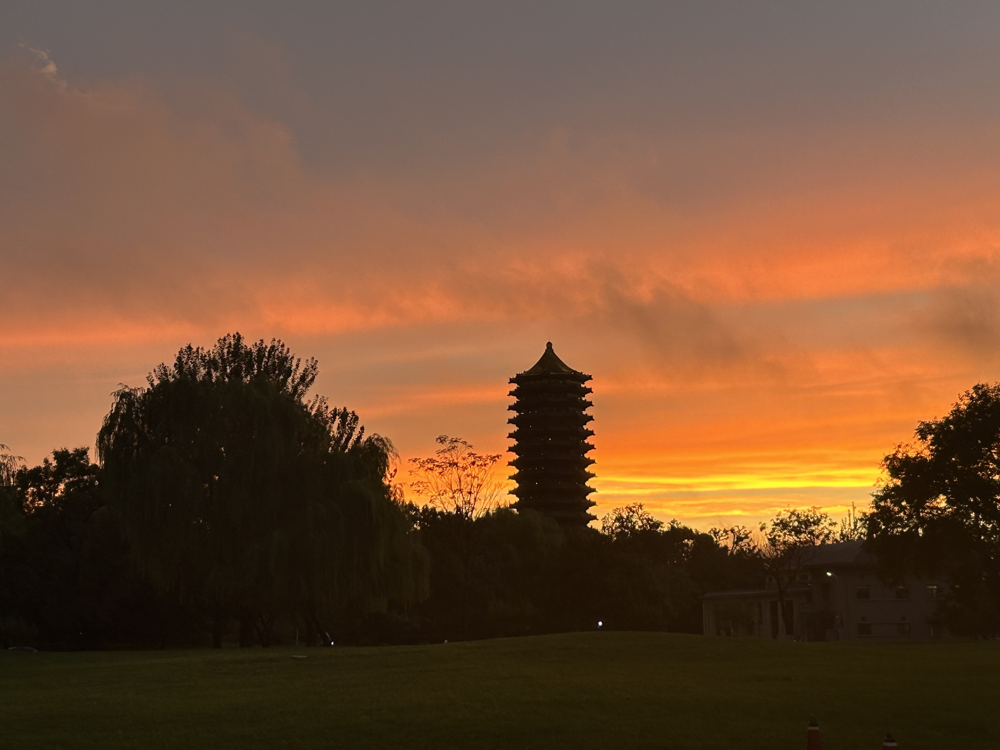
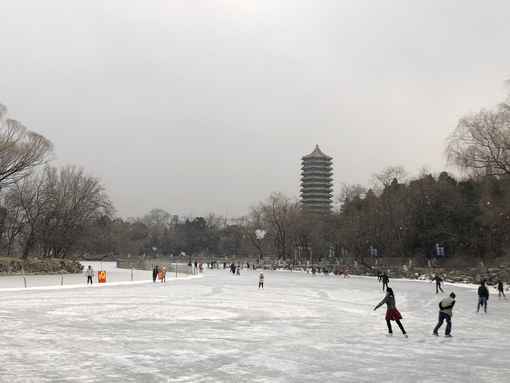
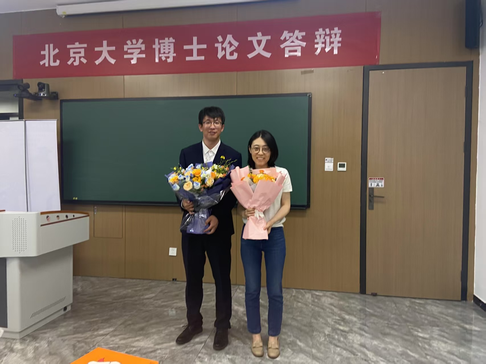
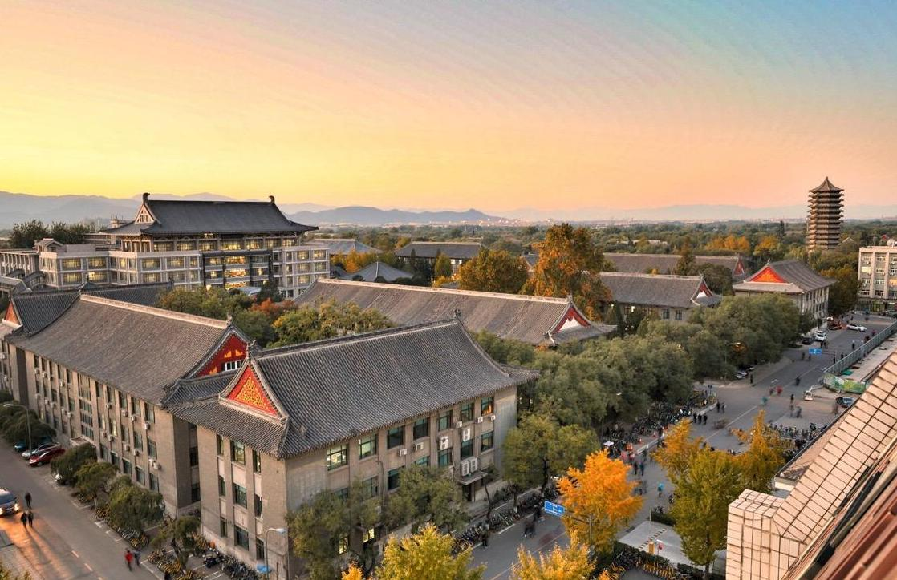

::: {.grid .align-items-center}

::: {.g-col-12 .g-col-md-3}
{width="100%" style="border-radius: 50%; aspect-ratio: 1/1; object-fit: cover; box-shadow: 0 4px 8px rgba(0,0,0,0.1);"}
:::

::: {.g-col-0 .g-col-md-1}
:::

::: {.g-col-12 .g-col-md-8}

Man, Yi (满怡), Ph.D.

Assistant Professor 
Department of Mechanics and Engineering Science, Peking University

  

  <strong>Email:</strong> <a href="mailto:yiman@pku.edu.cn" style="text-decoration:none; color:#0055aa;">yiman@pku.edu.cn</a> 
  <strong>Address:</strong> Room 4043, Enn Engineering Building, Haidian District, Beijing 
  <strong>Research areas:</strong> Low-Reynolds-number flows, Biological Locomotion, Active Matter

::: 

::: 

 

 

::: {.grid}

::: {.g-col-12 .g-col-md-6}
<h3 style="margin-bottom: 15px; color: #444;">PKU Campus</h3>

  

    
   

  
  

    
  

  
  

  

  
  

  

  
  

  

  
  <button class="carousel-control-prev" type="button" data-bs-target="#pkuCarousel" data-bs-slide="prev">
    
    Previous
  </button>
  <button class="carousel-control-next" type="button" data-bs-target="#pkuCarousel" data-bs-slide="next">
    
    Next
  </button>

:::

::: {.g-col-12 .g-col-md-6}
<h3 style="margin-bottom: 15px; color: #444;">Location</h3>

  
  <iframe src="https://www.google.com/maps/embed?pb=!1m18!1m12!1m3!1d1281.458700530942!2d116.3166361803481!3d39.99338026748352!2m3!1f0!2f0!3f0!3m2!1i1024!2i768!4f13.1!3m3!1m2!1s0x35f056aeeb50e6a9%3A0xbe803e43b65ef43f!2sPhysics%20School%20of%20Peking%20University!5e0!3m2!1sen!2stw!4v1766981695337!5m2!1sen!2stw" width="600" height="450" style="border:0;" allowfullscreen="" loading="lazy" referrerpolicy="no-referrer-when-downgrade"></iframe>

:::

:::

<!-- ::: {.g-col-12 .g-col-md-6}
<h3 style="margin-bottom: 15px; color: #444;">Location</h3>
{width="100%" style="border-radius: 8px; box-shadow: 0 4px 8px rgba(0,0,0,0.1); object-fit: cover; aspect-ratio: 4/3;"}
:::

::: -->