## Cover {.cover-slide}

::: {.cover-rule}
:::

::: {.cover-title}
Propulsion of a Spheroidal Self-Diffusiophoretic Particle in Complex Fluids
:::

::: {.cover-meta}
::: {.cover-authors}
Qiang Zhao, Guangpu Zhu, Lailai Zhu, On Shun Pak and Yi Man
:::
::: {.cover-event}
20th U.S. National Congress on Theoretical and Applied Mechanics
:::
::: {.cover-date}
June 22, 2026, Pasadena
:::
:::

---

## Non-Newtonian Biofluids {.motivation-slide}

::: {.nnfluids-layout}

::: {.nnfluids-column-layout}

::: {.nnfluids-notes}
Reproductive processes
:::

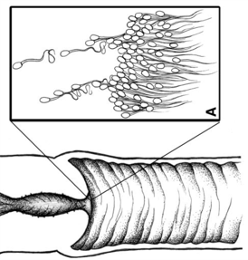

::: {.nnfluids-citation}
[Suarez and Pacey, Hum. Reprod. Update, 2006](https://academic.oup.com/humupd/article-abstract/12/1/23/607817?redirectedFrom=PDF)
:::

:::

::: {.nnfluids-column-layout}

::: {.nnfluids-notes}
Biofilm formation
:::

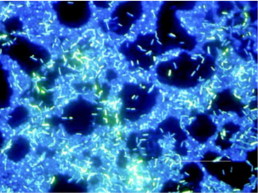

::: {.nnfluids-citation}
[Donlan, Emerg. Infect. Dis., 2002](https://pmc.ncbi.nlm.nih.gov/articles/PMC2732559/pdf/02-0063_FinalP.pdf)
:::

:::

::: {.nnfluids-column-layout}

::: {.nnfluids-notes}
Targeted drug delivery
:::

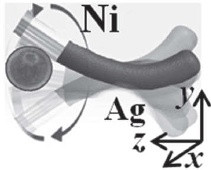

::: {.nnfluids-citation}
[Gao et al., Small, 2012](https://www.damtp.cam.ac.uk/user/lauga/papers/63.pdf)
:::

:::

:::

---

## Rheology Alters Biological Swimming {.motivation-slide}

::: {.rheology-effect-layout}

::: {.rheology-effect-column-layout}

::: {.rheology-effect-notes}
Swimming performance
:::

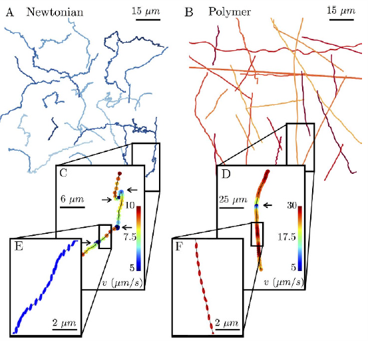

::: {.rheology-effect-citation}
[Patteson et al., Sci. Rep., 2015](https://www.nature.com/articles/srep15761.pdf)
:::

:::

::: {.rheology-effect-column-layout}

::: {.rheology-effect-notes}
Rheotactic responses
:::

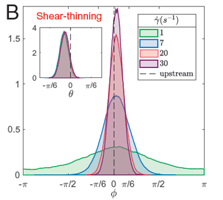

::: {.rheology-effect-citation}
[Torres et al., Proc. Natl. Acad. Sci. U.S.A., 2024](https://www.pnas.org/doi/pdf/10.1073/pnas.2417614121)
:::

:::

::: {.rheology-effect-column-layout}

::: {.rheology-effect-notes}
Collective behavior
:::

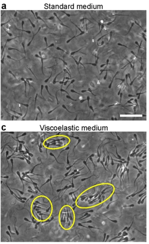

::: {.rheology-effect-citation}
[Tung et al., Sci. Rep., 2017](https://www.nature.com/articles/s41598-017-03341-4)
:::

:::

:::

---

## Speed in Shear-Thinning Fluids {.motivation-slide}

::: {.st-speed-layout}

::: {.st-speed-column-layout}

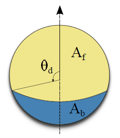

::: {.st-speed-citation}
&nbsp;
:::

::: {.st-speed-notes}
Self-diffusiophoretic spherical particle
:::

:::

::: {.st-speed-column-layout}

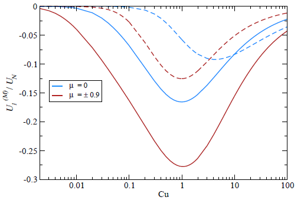

::: {.st-speed-citation}
[Datt et al., J. Fluid Mech., 2017](https://www.cambridge.org/core/journals/journal-of-fluid-mechanics/article/abs/an-active-particle-in-a-complex-fluid/CAAE79EB75E9CDEE9FAAB9281E6674B5)
:::

::: {.st-speed-notes}
Shear-thinning slows down propulsion
:::

:::

:::

---

## Speed in Viscoelastic Fluids {.motivation-slide}

::: {.ve-speed-layout}

::: {.ve-speed-column-layout}

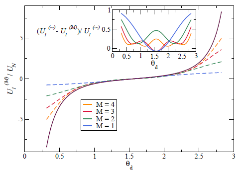

::: {.ve-speed-citation}
[Datt et al., J. Fluid Mech., 2017](https://www.cambridge.org/core/journals/journal-of-fluid-mechanics/article/abs/an-active-particle-in-a-complex-fluid/CAAE79EB75E9CDEE9FAAB9281E6674B5)
:::

::: {.ve-speed-notes}
First-order correction is antisymmetric with respect to coverage
:::

:::

::: {.ve-speed-column-layout}

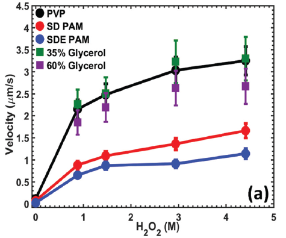

::: {.ve-speed-citation}
[Saad and Natale, Soft Matter, 2019](https://pubs.rsc.org/en/content/articlelanding/2019/sm/c9sm01801h/unauth)
:::

::: {.ve-speed-notes}
Experiments show slower propulsion for the half-coated particle
:::

:::

:::

---

## Geometry in Non-Newtonian Propulsion {.motivation-slide}

::: {.geometry-layout}

::: {.geometry-column-layout}

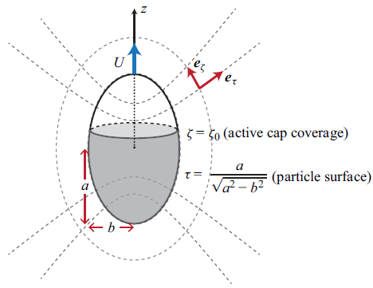

::: {.geometry-citation}
&nbsp;
:::

::: {.geometry-notes}
Self-diffusiophoretic spheroidal particle in shear-thinning fluids
:::

:::

::: {.geometry-column-layout}

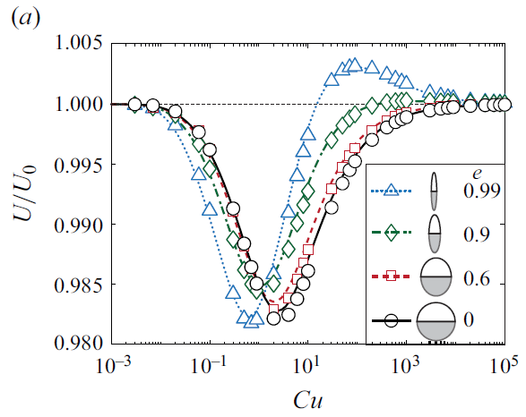

::: {.geometry-citation}
[Zhu et al., J. Fluid Mech., 2024](https://www.cambridge.org/core/journals/journal-of-fluid-mechanics/article/selfdiffusiophoretic-propulsion-of-a-spheroidal-particle-in-a-shearthinning-fluid/27AC0443994A1186CC5682BF016950B9)
:::

::: {.geometry-notes}
Eccentricity turns degradation into enhancement
:::

:::

:::

---

## Model: a spheroidal self-diffusiophoretic particle {.model-slide}

::: {.model-layout}

::: {.model-figure-wrap}
{.model-figure}
:::

::: {.model-notes}
- Solve the concentration and flow fields in [prolate spheroidal coordinates]{.key-term} $(\tau,\zeta)$
- Shape parameter: [[eccentricity]{.key-term} $e=\sqrt{a^2-b^2}/a$]{.no-break}
- Activity parameter: [[catalytic coverage]{.key-term} $\zeta_0$]{.no-break}

:::

:::

## Concentration gradients drive surface slip {.model-slide .slip-slide}

::: {.slip-layout}

::: {.slip-figure-wrap}
{.slip-figure}
:::

::: {.slip-content}

::: {.mechanism-block}
**Surface flux $\to$ Concentration field**

$$
\frac{\partial C}{\partial t}
+ \boldsymbol{u}\cdot\nabla C
= D\nabla^2 C,
\quad
\left. D\boldsymbol{n}\cdot\nabla C \right|_{\tau=\tau_0,\zeta<\zeta_0} = -A
$$

::: {.symbol-note}
$C$: solute concentration; $\boldsymbol{u}$: fluid velocity; $D$: diffusivity; $A$: surface activity / fixed solute flux on the active cap.
:::
:::

::: {.mechanism-block}
**Tangential gradient $\to$ Phoretic slip**

$$
\boldsymbol{u}_s
=
M(\boldsymbol{I}-\boldsymbol{n}\boldsymbol{n})\cdot \nabla C
$$

::: {.symbol-note}
$M$: phoretic mobility; the projection extracts the tangential concentration gradient.
:::
:::

::: {.mechanism-block}
**Slip velocity $\to$ Force-free propulsion**

::: {.propulsion-row}

::: {.propulsion-equation}
::: {.propulsion-equation-grid}

::: {.propulsion-formula}
$$
\boldsymbol{u}(\tau=\tau_0)
= \boldsymbol{u}_s(\zeta)+\boldsymbol{U},
$$
:::

::: {.propulsion-formula}
$$
\int_S \boldsymbol{n}\cdot\boldsymbol{\sigma}\,\mathrm{d}S
= \boldsymbol{0}
$$
:::

:::
:::

::: {.bio-analogy}
{.paramecium-figure}

biological propulsion analogy
:::

:::

:::

:::

:::

::: {.notes}
This is analogous to a squirmer: once there is a tangential slip on the surface, it drives the surrounding fluid, and the force-free condition determines the swimming velocity. The difference is that squirmer models often prescribe slip modes, whereas here the slip comes from the concentration field generated by surface chemistry.
:::

---

## Fluid rheology: second-order fluid model {.model-slide .rheology-slide}

::: {.rheology-content}

::: {.mechanism-block}
**Flow equations**

$$
\nabla\cdot\boldsymbol{\sigma}=\boldsymbol{0},
\qquad
\nabla\cdot\boldsymbol{u}=0,
\qquad
\boldsymbol{\sigma}=-p\boldsymbol{I}+\boldsymbol{T}
$$

::: {.symbol-note}
$\boldsymbol{u}$: fluid velocity; $\boldsymbol{\sigma}$: total stress; $p$: pressure; $\boldsymbol{T}$: deviatoric stress.
:::
:::

::: {.mechanism-block}
**Second-order fluid model**

::: {.rheology-equation-row}

::: {.rheology-main-equation}
$$
\boldsymbol{T}
=
\mu\dot{\boldsymbol{\gamma}}
-\frac{\Psi_1}{2}\boldsymbol{G}
+\Psi_2\dot{\boldsymbol{\gamma}}\cdot\dot{\boldsymbol{\gamma}},
$$
:::

::: {.rheology-main-equation}
$$
\begin{aligned}
\boldsymbol{G}
=&
\boldsymbol{u}\cdot\nabla\dot{\boldsymbol{\gamma}}
-(\nabla\boldsymbol{u})^{\mathrm{T}}\cdot\dot{\boldsymbol{\gamma}}
-\dot{\boldsymbol{\gamma}}\cdot\nabla\boldsymbol{u}
\end{aligned}
$$
:::

:::

::: {.symbol-note}
$\mu$: viscosity; $\dot{\boldsymbol{\gamma}}$: Newtonian shear-rate tensor; $\Psi_1,\Psi_2$: first and second normal-stress coefficients; $\boldsymbol{G}$: steady upper-convected derivative.
:::
:::

::: {.mechanism-block}
**Non-dimensionalization**

::: {.scale-row}
[length scale:]{.scale-label} semi-major axis of the particle  $a$,

[velocity scale:]{.scale-label} $MA/D$
:::

::: {.dimensionless-row}
[Peclet number (advection/diffusion):]{.scale-label} [$\mathrm{Pe}=\dfrac{MAa}{D^2}$]{style="color:#155a9c;"}

[Deborah number (fluid elasticity):]{.scale-label} [$\mathrm{De}=\dfrac{MA\Psi_1}{2\mu D a}$]{style="color:#8c0000;"}
:::

::: {.symbol-note}
$M$: phoretic mobility; $A$: surface activity.
:::
:::

:::

## Diffusion-dominated solute transport {.model-slide .diffusion-slide}

::: {.diffusion-content}

::: {.mechanism-block}
**Diffusion-dominated solute field**

$$
\nabla^2 c=0,
\qquad
\left.\boldsymbol{n}\cdot\nabla c\right|_{\tau=\tau_0}
=
\begin{cases}
-1, & \zeta\le \zeta_0 \quad \text{active},\\
0, & \zeta>\zeta_0 \quad \text{inert},
\end{cases}
\qquad
c|_{\tau\to\infty}=0
$$

::: {.symbol-note}
$c$: dimensionless relative solute concentration; $\tau=\tau_0$ denotes the particle surface.
:::
:::

::: {.mechanism-block}
**Series solution and induced slip**

::: {.solute-equation-row}

::: {.solute-main-equation}
$$
c(\tau,\zeta)
=
\sum_{n=0}^{\infty}
\rho_n Q_n(\tau)P_n(\zeta)
$$
:::

::: {.solute-main-equation}
$$
\implies u_s(\zeta)
=
\tau_0\sum_{n=1}^{\infty}
B_n\frac{P_n^1(\zeta)}{\sqrt{\tau_0^2-\zeta^2}}
$$
:::

:::

::: {.symbol-note}
$P_n$ and $Q_n$: Legendre functions; $\rho_n$ is determined from the flux boundary condition; $B_n=-\rho_n Q_n(\tau_0)$.
:::
:::

::: {.caveat-row}

::: {.caveat-block}

::: {.caveat-text}
**Note: finite-$\mathrm{Pe}$ coupling**

At finite $\mathrm{Pe}$, advection couples the solute field back to the flow. Then the rheology can also affect the concentration and the slip generated inside the interaction layer.
:::

:::

::: {.caveat-figure-wrap}
{.caveat-figure}

::: {.caveat-citation}
[Choudhary et al., J. Fluid Mech., 2020](https://www.cambridge.org/core/journals/journal-of-fluid-mechanics/article/nonnewtonian-effects-on-the-slip-and-mobility-of-a-selfpropelling-active-particle/BBF8AD5E37B5D3679BFC0A705750718C)
:::
:::

:::

:::

## Weakly non-Newtonian expansion {.model-slide .slip-slide}

::: {.asymptotic-content}

::: {.mechanism-block}
**Asymptotic expansion in Deborah number**

$$
\{\boldsymbol{u}, \dot{\boldsymbol{\gamma}}, \boldsymbol{\sigma}, p, \boldsymbol{T}, \boldsymbol{U}\} = \{\boldsymbol{u}_0, \dot{\boldsymbol{\gamma}}_0, \boldsymbol{\sigma}_0, p_0, \boldsymbol{T}_0, \boldsymbol{U}_0\} + De \{\boldsymbol{u}_1, \dot{\boldsymbol{\gamma}}_1, \boldsymbol{\sigma}_1, p_1, \boldsymbol{T}_1, \boldsymbol{U}_1\} + \mathcal{O}(De^2)
$$

::: {.symbol-note}
Subscript 0 denotes the Newtonian solution, while subscript 1 denotes the first-order viscoelastic correction.
:::
:::

::: {.mechanism-block}
**Zeroth-order Newtonian problem**

::: {.scale-row}
[flow equations:]{.scale-label}
:::
$$
\nabla \cdot \boldsymbol{u}_0 = 0, \qquad \nabla \cdot \boldsymbol{\sigma}_0 = \boldsymbol{0}, \qquad \boldsymbol{\sigma}_0 = -p_0 \boldsymbol{I} + \dot{\boldsymbol{\gamma}}_0
$$

::: {.scale-row}
[boundary conditions:]{.scale-label}
:::
$$
\boldsymbol{u}_0(\tau = \tau_0) = U_0 \boldsymbol{e}_z + u_s \boldsymbol{e}_\zeta, \qquad \boldsymbol{u}_0(\tau \rightarrow \infty) = \mathbf{0}
$$

::: {.symbol-note}
$U_0$: Newtonian propulsion speed obtained from the general solution reported in previous studies.
:::

:::

::: {.mechanism-block}
**First-order viscoelastic correction**

::: {.scale-row}
[flow equations:]{.scale-label}
:::
$$
\nabla \cdot \boldsymbol{u}_1 = 0, \qquad \nabla \cdot \boldsymbol{\sigma}_1 = \boldsymbol{0}, \qquad \boldsymbol{\sigma}_1 = -p_1 \boldsymbol{I} + \dot{\boldsymbol{\gamma}}_1 + \boldsymbol{A}
$$

$$
\boldsymbol{A} = - \left(\boldsymbol{G}_0 + b \dot{\boldsymbol{\gamma}}_0 \cdot \dot{\boldsymbol{\gamma}}_0\right)
$$

::: {.scale-row}
[boundary conditions:]{.scale-label}
:::
$$
\boldsymbol{u}_1(\tau = \tau_0) = U_1 \boldsymbol{e}_z, \qquad \boldsymbol{u}_1(\tau \rightarrow \infty) = \mathbf{0}
$$

::: {.symbol-note}
$b=-2\Psi_2/\Psi_1$: viscoelastic parameter; $U_1$: first-order correction obtained via the reciprocal theorem.
:::
:::

:::

---

## Reciprocal theorem gives the speed correction {.model-slide .slip-slide}

::: {.reciprocal-content}

::: {.mechanism-block}
**Auxiliary Stokes problem $\to$ reciprocity identity**

$$
\nabla \cdot \hat{\boldsymbol{u}} = 0, \qquad \nabla \cdot \hat{\boldsymbol{\sigma}} = \boldsymbol{0}, \qquad \hat{\boldsymbol{\sigma}} = -\hat{p} \boldsymbol{I} + \hat{\dot{\boldsymbol{\gamma}}}, \qquad \hat{\boldsymbol{u}}(\tau=\tau_0) = \hat{U}\boldsymbol{e}_z
$$

$$
\hat{\boldsymbol{u}} \cdot (\nabla \cdot \boldsymbol{\sigma}_1) = \boldsymbol{u}_1 \cdot (\nabla \cdot \hat{\boldsymbol{\sigma}}) = 0
$$

::: {.symbol-note}
$(\hat{\boldsymbol{u}},\hat{p})$: velocity and pressure fields of a rigid spheroid translating with arbitrary speed $\hat{U}$.
:::
:::

::: {.mechanism-block}
**Volume integration $\to$ reciprocal theorem**

$$
\int_S \boldsymbol{n} \cdot \hat{\boldsymbol{\sigma}} \cdot \boldsymbol{u}_1 \, \mathrm{d} S - \int_S \boldsymbol{n} \cdot \boldsymbol{\sigma}_1 \cdot \hat{\boldsymbol{u}} \, \mathrm{d} S = \int_V \boldsymbol{\sigma}_1 : \nabla \hat{\boldsymbol{u}} \, \mathrm{d} V - \int_V \hat{\boldsymbol{\sigma}} : \nabla \boldsymbol{u}_1 \, \mathrm{d} V
$$

$$
\hat{\boldsymbol{F}} \cdot \boldsymbol{U}_1 = \int_V \boldsymbol{A} : \nabla \hat{\boldsymbol{u}} \, \mathrm{d} V
$$

::: {.symbol-note}
$\hat{\boldsymbol{F}}$: hydrodynamic force acting on the translating auxiliary spheroid.
:::

:::

::: {.mechanism-block}
**Hydrodynamic drag $\to$ speed correction**

$$
\hat{\boldsymbol{F}} = - 8 \pi \tau_0^{-1} [(\tau_0^2+1) \coth^{-1} \tau_0 - \tau_0]^{-1} \boldsymbol{e}_z
$$

$$
U_1 = - \frac{(\tau_0^2+1) \coth^{-1} \tau_0 - \tau_0}{4 \tau_0^2} \int_{\tau_0}^{\infty} \int_{-1}^{1} (\boldsymbol{A} : \nabla \hat{\boldsymbol{u}}) (\tau^2 - \zeta^2) \, \mathrm{d} \zeta \, \mathrm{d} \tau
$$

:::

:::

---

## Geometric isotropy leads to antisymmetry {.results-slide}

::: {.sphere-result-layout}

::: {.sphere-result-figure-wrap}
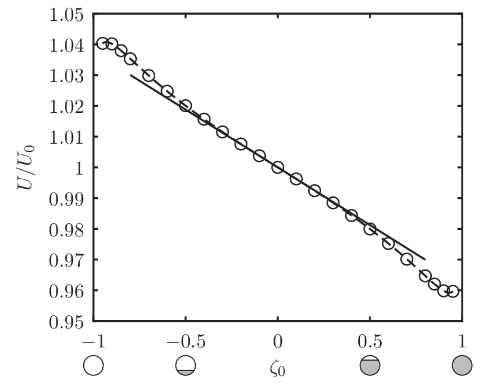{.sphere-result-figure}
:::

::: {.sphere-result-content}

::: {.mechanism-block}
**Spherical slip profile $\to U_1$**

$$
u_s(\zeta)=\sum_{n=1}^{\infty} B_n P_n^1(\zeta), \quad U_1 =  (b - 1) \sum_{n=1}^{\infty} K_n B_n B_{n+1}
$$

::: {.symbol-note}
$K_n$: analytically determined mode coefficients.
:::

:::

::: {.mechanism-block}
**Geometric isotropy $\to$ symmetry relations**

$$
u_s(-\zeta;-\zeta_0)=u_s(\zeta;\zeta_0), \quad U(\zeta_0,De)=U(-\zeta_0,-De)
$$

$$
U_{2n+1}(-\zeta_0)=-U_{2n+1}(\zeta_0), \quad U_{2n}(-\zeta_0)=U_{2n}(\zeta_0)
$$

:::

::: {.sphere-result-notes}
- Antisymmetric in the coverage $\zeta_0$
- Zero correction for half coverage
- Consistent with previous theory

:::

:::

:::

---

## Eccentricity-induced enhancement for half-coated particles {.results-slide}

::: {.halfcase-layout}

::: {.halfcase-figure-wrap}
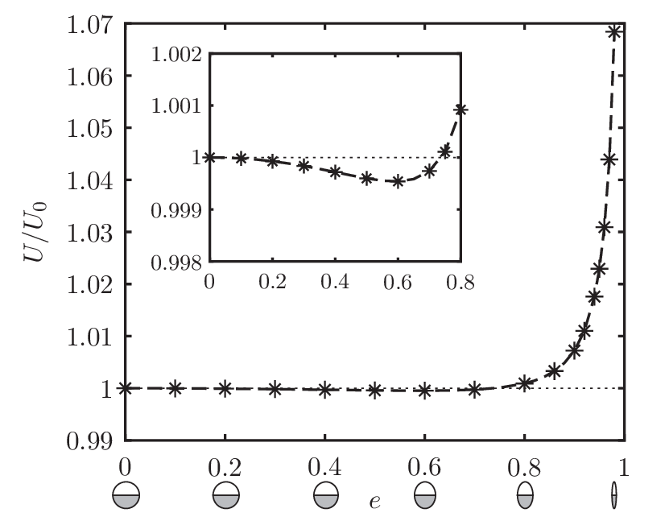{.halfcase-figure}
:::

::: {.halfcase-content}

::: {.halfcase-key}
Half-coated particle: $\zeta_0=0$
:::

::: {.halfcase-notes}

- Sphere: $U_1=0$ by symmetry
- Spheroid: eccentricity breaks the cancellation
- Slender shapes show pronounced enhancement

:::

:::

:::

---

## Eccentricity-induced symmetry breaking {.results-slide}

::: {.symmetry-breaking-layout}

::: {.symmetry-breaking-column-layout}

::: {.symmetry-breaking-notes}
Shape anisotropy breaks the antisymmetry of $U_1$
:::

:::

::: {.symmetry-breaking-column-layout}

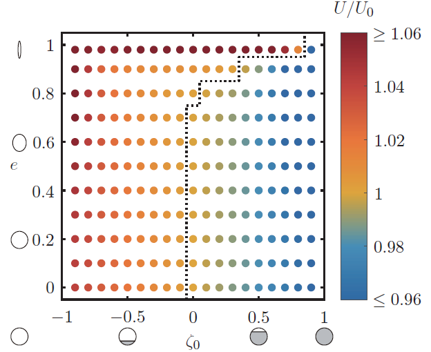

::: {.symmetry-breaking-notes}
Larger eccentricity broadens the enhancement regime
:::

:::

:::

---

## Mechanism: breaking local cancellation {.results-slide}

::: {.mechanism-layout}

::: {.mechanism-column-layout}

:::

::: {.mechanism-column-layout}
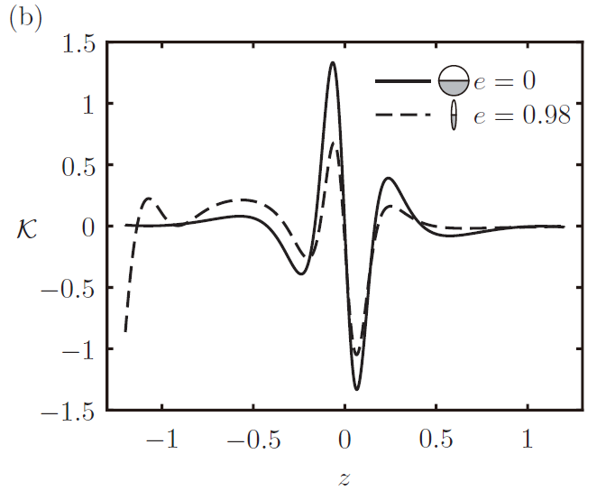
:::

:::

::: {.mechanism-notes}

- Spherical geometry yields antisymmetric local contributions
- Prolate geometry localizes gradients and breaks the cancellation

:::

---

## Summary {.summary-slide}

::: {.summary-layout}

::: {.summary-block}

::: {.summary-key}
Model
:::

::: {.summary-notes}
- Spheroidal Janus particle in a weakly viscoelastic fluid
- Asymptotic expansion combined with the reciprocal theorem
:::

:::

::: {.summary-block}

::: {.summary-key}
Findings
:::

::: {.summary-notes}
- Possible enhancement for half-coated spheroids
- Eccentricity broadens enhancement regimes
:::

:::

::: {.summary-block}

::: {.summary-key}
Significance
:::

::: {.summary-notes}
- Extends viscoelastic propulsion theory from spheres to anisotropic particles
- Provides design principles for active-particle transport in complex biological fluids
:::

:::
