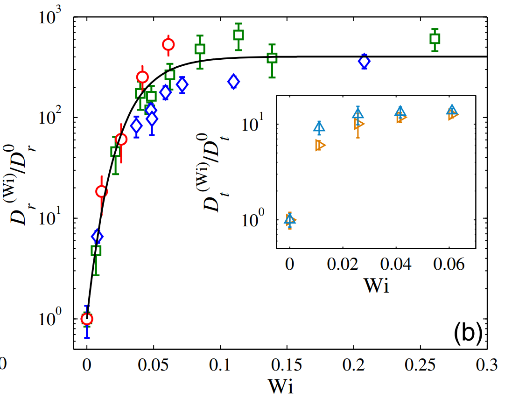
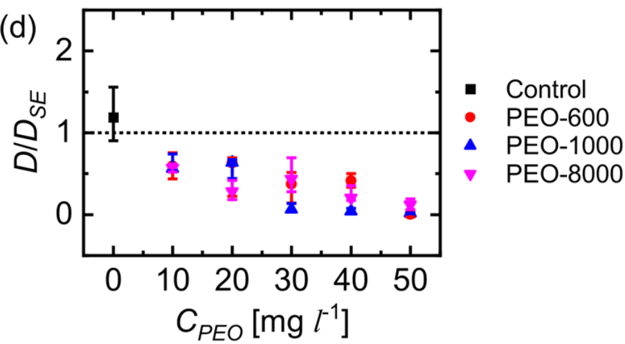
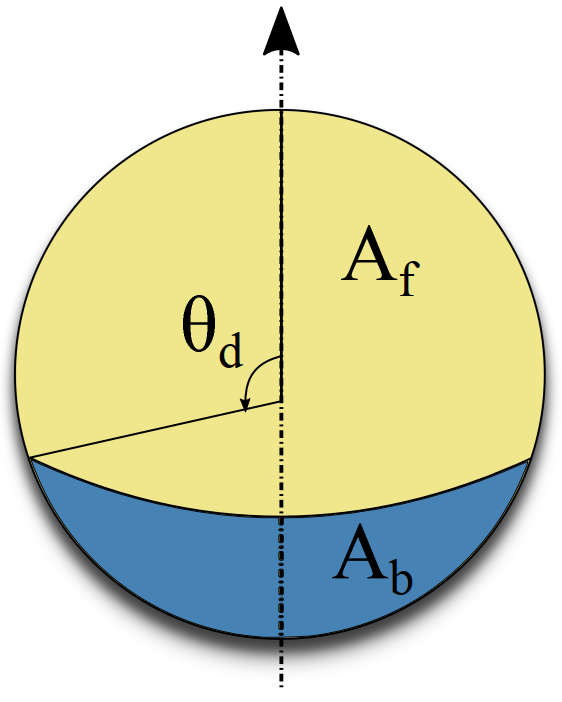
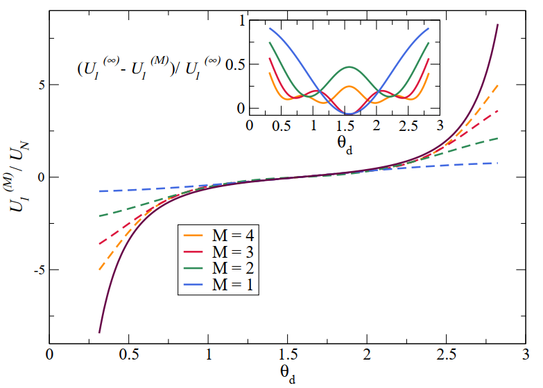
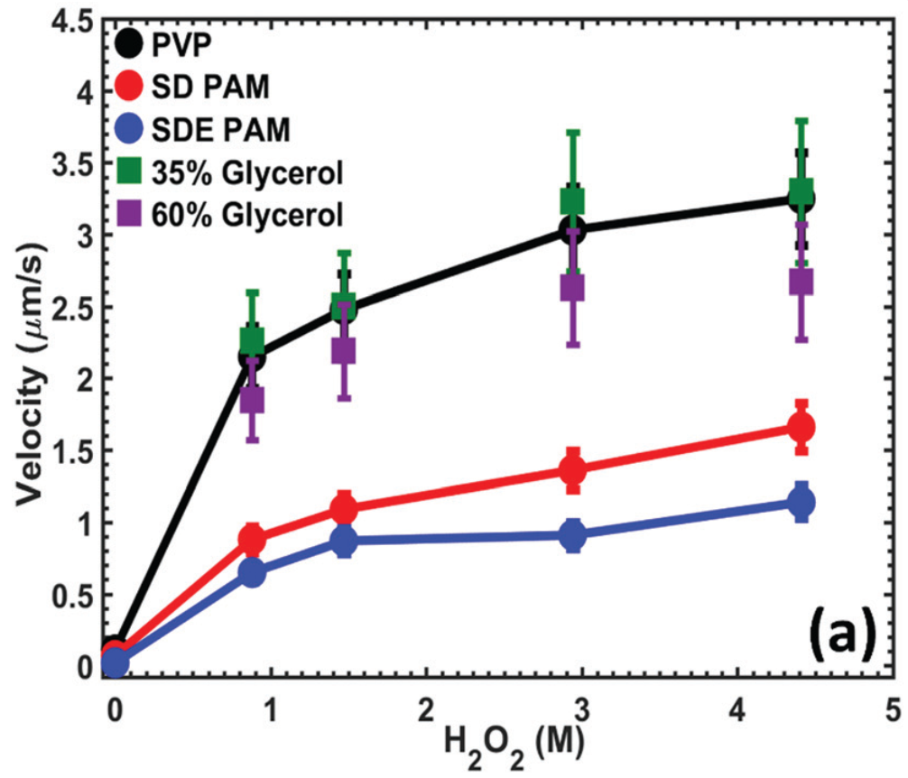
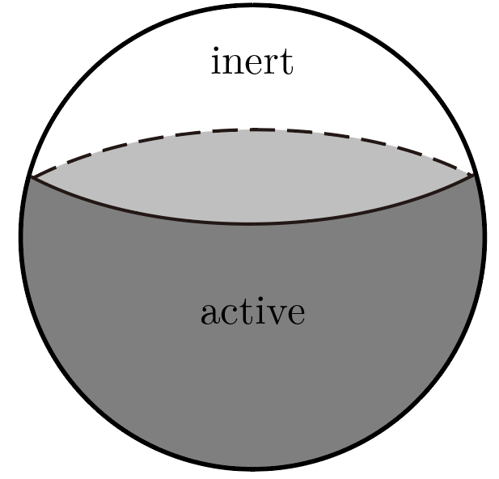
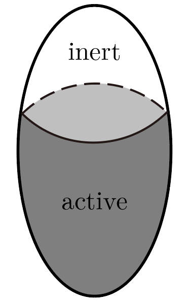
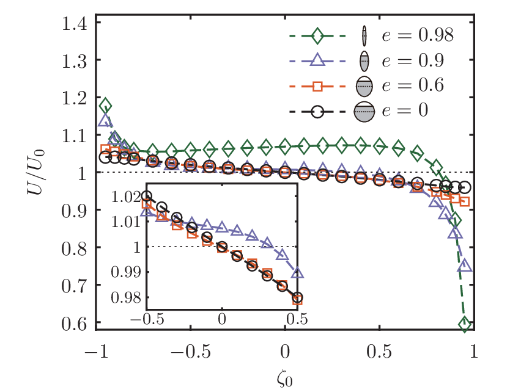
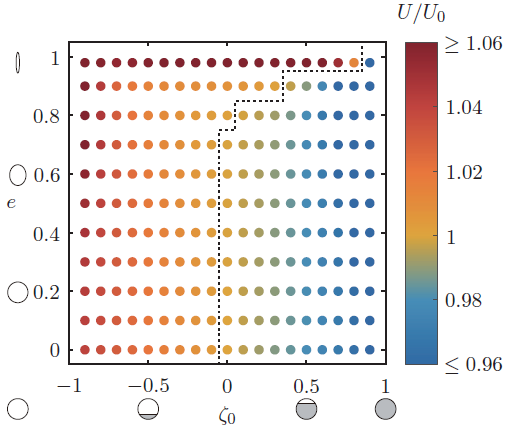
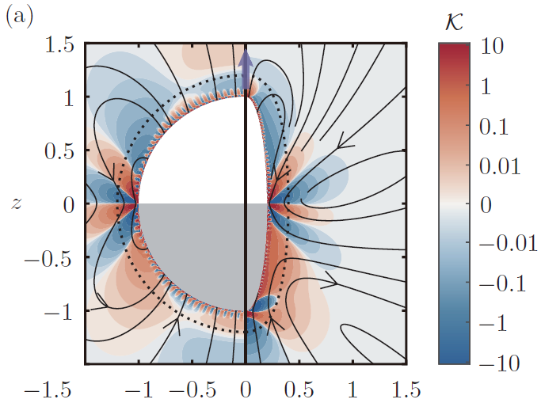

## Cover {.cover-slide}

::: {.cover-rule}
:::

::: {.cover-title}
Propulsion of a Spheroidal Self-Diffusiophoretic Particle in Complex Fluids
:::

::: {.cover-meta}
::: {.cover-authors}
Qiang Zhao, Guangpu Zhu, Lailai Zhu, On Shun Pak and Yi Man
:::
::: {.cover-event}
20th U.S. National Congress on Theoretical and Applied Mechanics
:::
::: {.cover-date}
June 22, 2026, Pasadena
:::
:::

---

## Non-Newtonian Biofluids {.motivation-slide}

::: {.nnfluids-layout}

::: {.nnfluids-column-layout}

::: {.nnfluids-citation}
[Bansil et al., Front. Immunol., 2013](https://www.frontiersin.org/journals/immunology/articles/10.3389/fimmu.2013.00310/full)
:::

::: {.nnfluids-notes}
Polymeric microstructure of human mucus
:::

:::

::: {.nnfluids-column-layout}

::: {.nnfluids-citation}
&nbsp;
:::

::: {.nnfluids-notes}
Viscous and elastic responses coexist across timescales
:::

:::

:::

::: {.mucus-summary-row}

::: {.mucus-summary-figure-wrap}
{.mucus-microstructure-figure}
:::

::: {.mucus-summary-text}
Polymer-containing biofluids, such as mucus, exhibit heterogeneous microstructures and viscoelastic rheology
:::

:::

---

## Rheology Alters Biological Swimming {.motivation-slide}

::: {.rheology-effect-layout}

::: {.rheology-effect-column-layout}

::: {.rheology-effect-citation}
[Patteson et al., Sci. Rep., 2015](https://www.nature.com/articles/srep15761.pdf)
:::

::: {.rheology-effect-notes}
Elastic stresses suppress inefficient body wobbling, allowing *E. coli* to swim faster
:::

:::

::: {.rheology-effect-column-layout}

::: {.rheology-effect-citation}
[Tung et al., Sci. Rep., 2017](https://www.nature.com/articles/s41598-017-03341-4)
:::

::: {.rheology-effect-notes}
Fluid viscoelasticity strengthens sperm–sperm interactions and promotes collective swimming
:::

:::

:::

---

## Self-Diffusiophoretic Janus Particles {.motivation-slide}

::: {.Janus-layout}

::: {.Janus-column-layout}

::: {.Janus-citation}
[Saad and Natale, Soft Matter, 2019](https://pubs.rsc.org/en/content/articlelanding/2019/sm/c9sm01801h/unauth)
:::

::: {.Janus-notes}
A catalytic Janus particle with asymmetric surface coating
:::

:::

::: {.Janus-column-layout}

::: {.Janus-citation}
[Moran and Posner, Annu. Rev. Fluid Mech., 2017](https://www.annualreviews.org/content/journals/10.1146/annurev-fluid-122414-034456)
:::

::: {.Janus-notes}
Asymmetric surface reactions create a self-generated solute gradient that drives diffusiophoretic motion
:::

:::

:::

---

## Viscoelasticity Reshapes Janus-Particle Diffusion {.motivation-slide}

::: {.ve-layout}

::: {.ve-column-layout}

::: {.ve-citation}
[Gomez-Solano et al., Phys. Rev. Lett., 2016](https://journals.aps.org/prl/abstract/10.1103/PhysRevLett.116.138301)
:::

::: {.ve-notes}
Rotational diffusion increases dramatically with increasing viscoelasticity and eventually saturates
:::

:::

::: {.ve-column-layout}

::: {.ve-citation}
[Raman et al., ACS Phys. Chem. Au, 2023](https://pubs.acs.org/doi/full/10.1021/acsphyschemau.2c00056)
:::

::: {.ve-notes}
Translational diffusion falls far below the Stokes–Einstein prediction as polymer concentration increases
:::

:::

:::

::: {.janus-diffusion-transition}
These pronounced changes have motivated theoretical studies of active-particle dynamics in viscoelastic fluids.
:::

---

## Viscoelastic Propulsion of a Spherical Janus Particle {.motivation-slide}

::: {.datt-layout}

::: {.datt-column-layout}

::: {.datt-citation}
[Datt et al., J. Fluid Mech., 2017](https://www.cambridge.org/core/journals/journal-of-fluid-mechanics/article/abs/an-active-particle-in-a-complex-fluid/CAAE79EB75E9CDEE9FAAB9281E6674B5)
:::

:::

::: {.datt-column-layout}

::: {.datt-citation}
&nbsp;
:::

:::

:::

::: {.datt-findings}
- The first-order viscoelastic correction is antisymmetric with respect to the surface coverage
- For the commonly studied half-coated particle, the first-order speed correction vanishes
:::

::: {.datt-tension-row}

::: {.datt-tension-text}
An apparent theory–experiment tension

Weakly viscoelastic theory predicts no speed change for a half-coated sphere, whereas experiments report reduced propulsion in viscoelastic fluids.
:::

::: {.datt-experiment-wrap}

{.datt-experiment-figure}

::: {.datt-experiment-citation}
[Saad and Natale, Soft Matter, 2019](https://pubs.rsc.org/en/content/articlelanding/2019/sm/c9sm01801h)
:::

:::

:::

---

## What Changes for a Non-Spherical Janus Particle? {.motivation-slide}

::: {.geometry-question-layout}

::: {.geometry-question-column}

{.geometry-question-figure}

::: {.geometry-question-key}
Spherical Janus particle
:::

::: {.geometry-question-note}
First-order correction is antisymmetric with respect to surface coverage
:::

:::

::: {.geometry-question-center}
?
:::

::: {.geometry-question-column}

{.geometry-question-figure}

::: {.geometry-question-key}
Spheroidal Janus particle
:::

::: {.geometry-question-note}
How geometric anisotropy modifies viscoelastic propulsion remains unclear
:::

:::

:::

::: {.geometry-question-box}
- Does the spherical cancellation persist for a non-spherical Janus particle?
- How do eccentricity and surface coverage control viscoelastic propulsion?
:::

---

## Model: a spheroidal self-diffusiophoretic particle {.model-slide}

::: {.model-layout}

::: {.model-figure-wrap}
{.model-figure}
:::

::: {.model-notes}
- Solve the concentration and flow fields in [prolate spheroidal coordinates]{.key-term} $(\tau,\zeta)$
- Shape parameter: [[eccentricity]{.key-term} $e=\sqrt{a^2-b^2}/a$]{.no-break}
- Activity parameter: [[catalytic coverage]{.key-term} $\zeta_0$]{.no-break}

:::

:::

## Concentration gradients drive surface slip {.model-slide .slip-slide}

::: {.slip-layout}

::: {.slip-figure-wrap}
{.slip-figure}
:::

::: {.slip-content}

::: {.mechanism-block}
**Surface flux $\to$ Concentration field**

$$
\frac{\partial C}{\partial t}
+ \boldsymbol{u}\cdot\nabla C
= D\nabla^2 C,
\quad
\left. D\boldsymbol{n}\cdot\nabla C \right|_{\tau=\tau_0,\zeta<\zeta_0} = -A
$$

::: {.symbol-note}
$C$: solute concentration; $\boldsymbol{u}$: fluid velocity; $D$: diffusivity; $A$: surface activity / fixed solute flux on the active cap.
:::
:::

::: {.mechanism-block}
**Tangential gradient $\to$ Phoretic slip**

$$
\boldsymbol{u}_s
=
M(\boldsymbol{I}-\boldsymbol{n}\boldsymbol{n})\cdot \nabla C
$$

::: {.symbol-note}
$M$: phoretic mobility; the projection extracts the tangential concentration gradient.
:::
:::

::: {.mechanism-block}
**Slip velocity $\to$ Force-free propulsion**

::: {.propulsion-row}

::: {.propulsion-equation}
::: {.propulsion-equation-grid}

::: {.propulsion-formula}
$$
\boldsymbol{u}(\tau=\tau_0)
= \boldsymbol{u}_s(\zeta)+\boldsymbol{U},
$$
:::

::: {.propulsion-formula}
$$
\int_S \boldsymbol{n}\cdot\boldsymbol{\sigma}\,\mathrm{d}S
= \boldsymbol{0}
$$
:::

:::
:::

::: {.bio-analogy}
{.paramecium-figure}

biological propulsion analogy
:::

:::

:::

:::

:::

::: {.notes}
This is analogous to a squirmer: once there is a tangential slip on the surface, it drives the surrounding fluid, and the force-free condition determines the swimming velocity. The difference is that squirmer models often prescribe slip modes, whereas here the slip comes from the concentration field generated by surface chemistry.
:::

---

## Fluid rheology: second-order fluid model {.model-slide .rheology-slide}

::: {.rheology-content}

::: {.mechanism-block}
**Flow equations**

$$
\nabla\cdot\boldsymbol{\sigma}=\boldsymbol{0},
\qquad
\nabla\cdot\boldsymbol{u}=0,
\qquad
\boldsymbol{\sigma}=-p\boldsymbol{I}+\boldsymbol{T}
$$

::: {.symbol-note}
$\boldsymbol{u}$: fluid velocity; $\boldsymbol{\sigma}$: total stress; $p$: pressure; $\boldsymbol{T}$: deviatoric stress.
:::
:::

::: {.mechanism-block}
**Second-order fluid model**

::: {.rheology-equation-row}

::: {.rheology-main-equation}
$$
\boldsymbol{T}
=
\mu\dot{\boldsymbol{\gamma}}
-\frac{\Psi_1}{2}\boldsymbol{G}
+\Psi_2\dot{\boldsymbol{\gamma}}\cdot\dot{\boldsymbol{\gamma}},
$$
:::

::: {.rheology-main-equation}
$$
\begin{aligned}
\boldsymbol{G}
=&
\boldsymbol{u}\cdot\nabla\dot{\boldsymbol{\gamma}}
-(\nabla\boldsymbol{u})^{\mathrm{T}}\cdot\dot{\boldsymbol{\gamma}}
-\dot{\boldsymbol{\gamma}}\cdot\nabla\boldsymbol{u}
\end{aligned}
$$
:::

:::

::: {.symbol-note}
$\mu$: viscosity; $\dot{\boldsymbol{\gamma}}$: Newtonian shear-rate tensor; $\Psi_1,\Psi_2$: first and second normal-stress coefficients; $\boldsymbol{G}$: steady upper-convected derivative.
:::
:::

::: {.mechanism-block}
**Non-dimensionalization**

::: {.scale-row}
[length scale:]{.scale-label} semi-major axis of the particle  $a$,

[velocity scale:]{.scale-label} $MA/D$
:::

::: {.dimensionless-row}
[Peclet number (advection/diffusion):]{.scale-label} [$\mathrm{Pe}=\dfrac{MAa}{D^2}$]{style="color:#155a9c;"}

[Deborah number (fluid elasticity):]{.scale-label} [$\mathrm{De}=\dfrac{MA\Psi_1}{2\mu D a}$]{style="color:#8c0000;"}
:::

::: {.symbol-note}
$M$: phoretic mobility; $A$: surface activity.
:::
:::

:::

## Diffusion-dominated solute transport {.model-slide .diffusion-slide}

::: {.diffusion-content}

::: {.mechanism-block}
**Diffusion-dominated solute field**

$$
\nabla^2 c=0,
\qquad
\left.\boldsymbol{n}\cdot\nabla c\right|_{\tau=\tau_0}
=
\begin{cases}
-1, & \zeta\le \zeta_0 \quad \text{active},\\
0, & \zeta>\zeta_0 \quad \text{inert},
\end{cases}
\qquad
c|_{\tau\to\infty}=0
$$

::: {.symbol-note}
$c$: dimensionless relative solute concentration; $\tau=\tau_0$ denotes the particle surface.
:::
:::

::: {.mechanism-block}
**Series solution and induced slip**

::: {.solute-equation-row}

::: {.solute-main-equation}
$$
c(\tau,\zeta)
=
\sum_{n=0}^{\infty}
\rho_n Q_n(\tau)P_n(\zeta)
$$
:::

::: {.solute-main-equation}
$$
\implies u_s(\zeta)
=
\tau_0\sum_{n=1}^{\infty}
B_n\frac{P_n^1(\zeta)}{\sqrt{\tau_0^2-\zeta^2}}
$$
:::

:::

::: {.symbol-note}
$P_n$ and $Q_n$: Legendre functions; $\rho_n$ is determined from the flux boundary condition; $B_n=-\rho_n Q_n(\tau_0)$.
:::
:::

::: {.caveat-row}

::: {.caveat-block}

::: {.caveat-text}
**Note: finite-$\mathrm{Pe}$ coupling**

At finite $\mathrm{Pe}$, advection couples the solute field back to the flow. Then the rheology can also affect the concentration and the slip generated inside the interaction layer.
:::

:::

::: {.caveat-figure-wrap}
{.caveat-figure}

::: {.caveat-citation}
[Choudhary et al., J. Fluid Mech., 2020](https://www.cambridge.org/core/journals/journal-of-fluid-mechanics/article/nonnewtonian-effects-on-the-slip-and-mobility-of-a-selfpropelling-active-particle/BBF8AD5E37B5D3679BFC0A705750718C)
:::
:::

:::

:::

## Weakly non-Newtonian expansion {.model-slide .slip-slide}

::: {.asymptotic-story}

::: {.mechanism-block}

::: {.asymptotic-step-key}
**Weak elasticity permits a perturbation expansion**
:::

::: {.asymptotic-step-text}
For $\mathrm{De}\ll1$, the propulsion problem is expanded about its Newtonian limit:
:::

$$
\{\boldsymbol{u}, p, \boldsymbol{U}\} = \{\boldsymbol{u}_0, p_0, \boldsymbol{U}_0\} + \mathrm{De} \{\boldsymbol{u}_1, p_1, \boldsymbol{U}_1\} + \mathcal{O}(\mathrm{De}^2)
$$

::: {.symbol-note}
Subscript $0$ denotes the Newtonian base state, while subscript $1$ denotes the leading viscoelastic correction.
:::

:::

::: {.mechanism-block}

::: {.asymptotic-step-key}
**The Newtonian base state is already known**
:::

::: {.asymptotic-step-text}
The concentration field determines the surface slip, and previous solutions provide the corresponding Newtonian flow $\boldsymbol{u}_0$ and propulsion speed $U_0$ for a spheroidal particle.
:::

::: {.known-state-row}

::: {.known-state-item}
Concentration field
:::

::: {.known-state-arrow}
$\longrightarrow$
:::

::: {.known-state-item}
Surface slip
:::

::: {.known-state-arrow}
$\longrightarrow$
:::

::: {.known-state-item}
Known Newtonian flow $\boldsymbol{u}_0$
:::

:::

:::

::: {.mechanism-block .asymptotic-focus}

::: {.asymptotic-step-key}
**Viscoelasticity enters through an additional first-order stress**
:::

::: {.asymptotic-step-text}
The first-order nonlinear contribution is determined by the Newtonian flow:
:::

$$
\boldsymbol{\sigma}_1 = -p_1 \boldsymbol{I} + \dot{\boldsymbol{\gamma}}_1 + \boldsymbol{A}, \qquad \boldsymbol{A} = -(\boldsymbol{G}_0 + b \dot{\boldsymbol{\gamma}}_0\cdot\dot{\boldsymbol{\gamma}}_0)
$$

::: {.symbol-note}
$b=-2\Psi_2/\Psi_1$: viscoelastic parameter; $\boldsymbol{A}$: known forcing term that drives the first-order correction.
:::

:::

:::

---

## Reciprocal theorem gives the speed correction {.model-slide .slip-slide}

::: {.reciprocal-story}

::: {.mechanism-block}

::: {.reciprocal-step-key}
**A virtual towing problem provides the resistance needed to determine $U_1$**
:::

::: {.reciprocal-step-text}
We consider a rigid spheroid of the same geometry translating in a Newtonian fluid:
:::

$$
\hat{\boldsymbol{u}}(\tau=\tau_0) = \hat{U}\boldsymbol{e}_z, \qquad \hat{\boldsymbol{F}} = \int_S \boldsymbol{n}\cdot\hat{\boldsymbol{\sigma}}\,\mathrm{d}S
$$

::: {.symbol-note}
$(\hat{\boldsymbol{u}},\hat{\boldsymbol{\sigma}})$ denote the known auxiliary velocity and stress fields.
:::

:::

::: {.mechanism-block}

::: {.reciprocal-step-key}
**The reciprocal theorem avoids solving the first-order flow**
:::

::: {.reciprocal-step-text}
The reciprocal theorem eliminates $\boldsymbol{u}_1$ by linking the $\mathcal{O}(\mathrm{De})$ problem to the auxiliary flow:
:::

$$
\hat{\boldsymbol{F}}\cdot\boldsymbol{U}_1 = \int_V \boldsymbol{A} : \nabla\hat{\boldsymbol{u}}\,\mathrm{d}V
$$

::: {.symbol-note}
The kernel characterizes the local power-density contribution associated with the viscoelastic stress.
:::

:::

::: {.mechanism-block .reciprocal-focus}

::: {.reciprocal-step-key}
**The first-order propulsion correction follows directly**
:::

::: {.reciprocal-step-text}
Using the known force on the auxiliary spheroid, we obtain:
:::

$$
U_1 = - \frac{(\tau_0^2+1) \coth^{-1} \tau_0 - \tau_0}{4 \tau_0^2} \int_{\tau_0}^{\infty} \int_{-1}^{1} (\boldsymbol{A} : \nabla \hat{\boldsymbol{u}}) (\tau^2 - \zeta^2) \, \mathrm{d} \zeta \, \mathrm{d} \tau
$$

:::

:::

---

## Geometric isotropy leads to antisymmetry {.results-slide}

::: {.sphere-result-layout}

::: {.sphere-result-figure-wrap}
{.sphere-result-figure}
:::

::: {.sphere-result-content}

::: {.mechanism-block}
**The spherical-limit slip determines $U_1$**

$$
u_s(\zeta)=\sum_{n=1}^{\infty} B_n P_n^1(\zeta), \quad U_1 =  (b - 1) \sum_{n=1}^{\infty} K_n B_n B_{n+1}
$$

::: {.symbol-note}
$B_n$ denotes the phoretic modes, while $K_n$ is determined analytically.
:::

:::

::: {.mechanism-block}
**Spherical isotropy relates complementary coverages**

::: {.sphere-result-text}
Reflecting the coating distribution about the equator gives
:::

$$
u_s(-\zeta;-\zeta_0)=u_s(\zeta;\zeta_0), \quad U(\zeta_0,De)=U(-\zeta_0,-De)
$$

::: {.sphere-result-text}
and therefore
:::

$$
U_{2n+1}(-\zeta_0)=-U_{2n+1}(\zeta_0), \quad U_{2n}(-\zeta_0)=U_{2n}(\zeta_0)
$$

:::

::: {.sphere-result-notes}
For a sphere, the first-order viscoelastic correction is antisymmetric in surface coverage and therefore vanishes at half coverage.
:::

:::

:::

---

## Eccentricity-induced enhancement for half-coated particles {.results-slide}

::: {.halfcase-layout}

::: {.halfcase-figure-wrap}
{.halfcase-figure}
:::

::: {.halfcase-content}

::: {.halfcase-key}
Half-coated particle: $\zeta_0=0$
:::

::: {.halfcase-notes}

- Sphere: $U_1=0$ by symmetry
- Spheroid: eccentricity breaks the cancellation
- Slender shapes show pronounced enhancement

:::

:::

:::

---

## Eccentricity-induced symmetry breaking {.results-slide}

::: {.symmetry-breaking-layout}

::: {.symmetry-breaking-column-layout}

::: {.symmetry-breaking-notes}
Shape anisotropy breaks the antisymmetry of $U_1$
:::

:::

::: {.symmetry-breaking-column-layout}

::: {.symmetry-breaking-notes}
Larger eccentricity broadens the enhancement regime
:::

:::

:::

---

## Broken kernel cancellation enhances propulsion {.results-slide}

::: {.mechanism-layout}

::: {.mechanism-column-layout}

:::

::: {.mechanism-column-layout}

:::

:::

::: {.mechanism-notes}

- Spherical geometry yields antisymmetric local contributions
- Prolate geometry localizes gradients and breaks the cancellation

:::

---

## Summary {.summary-slide}

::: {.summary-layout}

::: {.summary-card}

::: {.summary-figure-wrap}
{.summary-figure}
:::

::: {.summary-key}
Spherical symmetry
:::

::: {.summary-text}
For spheres, the first-order correction is antisymmetric and vanishes at half coverage.
:::

:::

::: {.summary-card}

::: {.summary-figure-wrap}
{.summary-figure}
:::

::: {.summary-key}
Shape-induced enhancement
:::

::: {.summary-text}
Slender spheroids can exhibit pronounced speed enhancement.
:::

:::

::: {.summary-card}

::: {.summary-figure-wrap}
{.summary-figure}
:::

::: {.summary-key}
Tunable propulsion
:::

::: {.summary-text}
Shape and surface coverage jointly determine whether viscoelasticity enhances or suppresses propulsion.
:::

:::

:::

::: {.summary-takehome}
Particle shape provides a direct control parameter for active propulsion in viscoelastic fluids.
:::

---

## Acknowledgments {.acknowledgment-slide}

::: {.acknowledgment-layout}

::: {.acknowledgment-person}

{.acknowledgment-photo}

::: {.acknowledgment-name}
Qiang Zhao
:::

::: {.acknowledgment-role}
Ph.D. Student
:::

::: {.acknowledgment-affiliation}
College of Engineering, Peking University
:::

:::

:::

::: {.acknowledgment-footer}

::: {.acknowledgment-item}
Helpful discussions: On Shun Pak and Brandon Van Gogh
:::

::: {.acknowledgment-item}
Funding: National Natural Science Foundation of China
(12372258, 12588201, and 12502294); Jiangsu Specially-Appointed Professor Program; start-up funding (1001-YQR25024)
:::

:::
