## Cover {.cover-slide}

::: {.cover-rule}
:::

::: {.cover-title}
Propulsion of a Spheroidal Self-Diffusiophoretic Particle in Complex Fluids
:::

::: {.cover-meta}
::: {.cover-authors}
Qiang Zhao1, Guangpu Zhu2, Lailai Zhu2, On Shun Pak3 and Yi Man1
:::

::: {.cover-affiliations}
1 Peking University 
2 National University of Singapore 
3 Santa Clara University
:::

::: {.cover-event}
20th U.S. National Congress on Theoretical and Applied Mechanics
:::
::: {.cover-date}
June 22, 2026, Pasadena
:::
:::

---

## Non-Newtonian Biofluids {.motivation-slide data-visibility="hidden"}

::: {.nnfluids-layout}

::: {.nnfluids-column-layout}

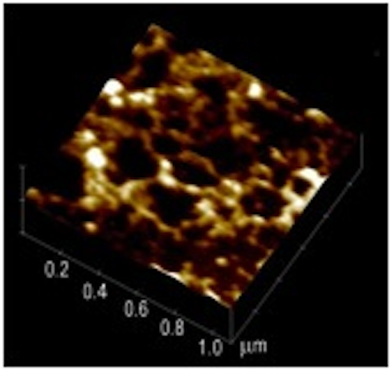

::: {.nnfluids-citation}
[Bansil et al., Front. Immunol., 2013](https://www.frontiersin.org/journals/immunology/articles/10.3389/fimmu.2013.00310/full)
:::

::: {.nnfluids-notes}
Polymeric microstructure of human mucus
:::

:::

::: {.nnfluids-column-layout}

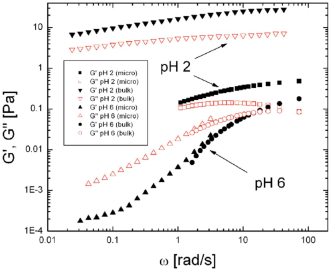

::: {.nnfluids-citation}
&nbsp;
:::

::: {.nnfluids-notes}
Viscous and elastic responses coexist across timescales
:::

:::

:::

::: {.mucus-summary-row}

::: {.mucus-summary-figure-wrap}
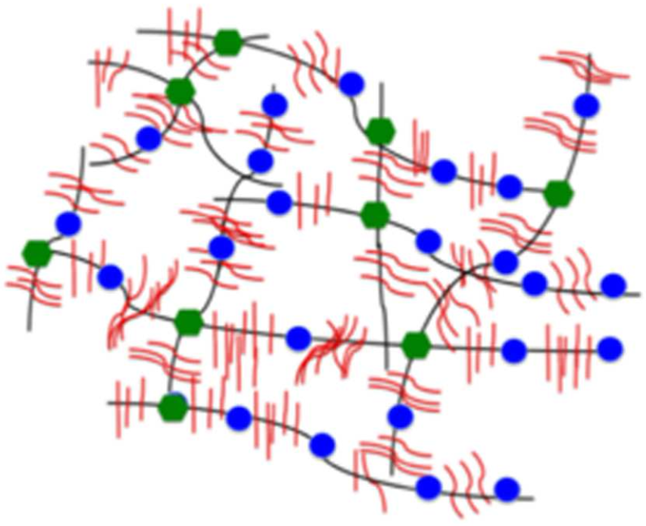{.mucus-microstructure-figure}
:::

::: {.mucus-summary-text}
Polymer-containing biofluids, such as mucus, exhibit heterogeneous microstructures and viscoelastic rheology
:::

:::

---

## Rheology Alters Biological Swimming {.motivation-slide data-visibility="hidden"}

::: {.rheology-effect-layout}

::: {.rheology-effect-column-layout}

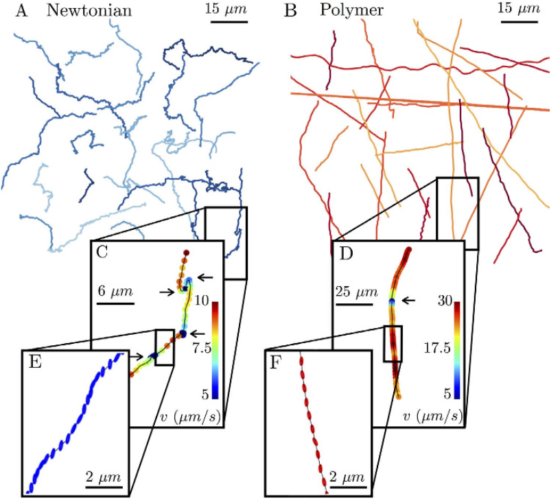

::: {.rheology-effect-citation}
[Patteson et al., Sci. Rep., 2015](https://www.nature.com/articles/srep15761.pdf)
:::

::: {.rheology-effect-notes}
Elastic stresses suppress inefficient body wobbling, allowing *E. coli* to swim faster
:::

:::

::: {.rheology-effect-column-layout}

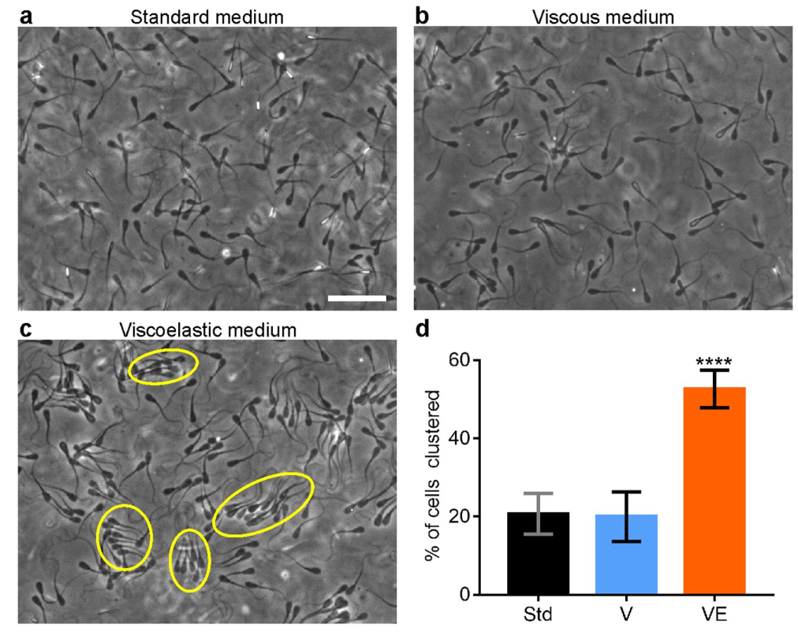

::: {.rheology-effect-citation}
[Tung et al., Sci. Rep., 2017](https://www.nature.com/articles/s41598-017-03341-4)
:::

::: {.rheology-effect-notes}
Fluid viscoelasticity strengthens sperm–sperm interactions and promotes collective swimming
:::

:::

:::

---

## Self-Diffusiophoretic Janus Particles {.motivation-slide data-visibility="hidden"}

::: {.Janus-layout}

::: {.Janus-column-layout}

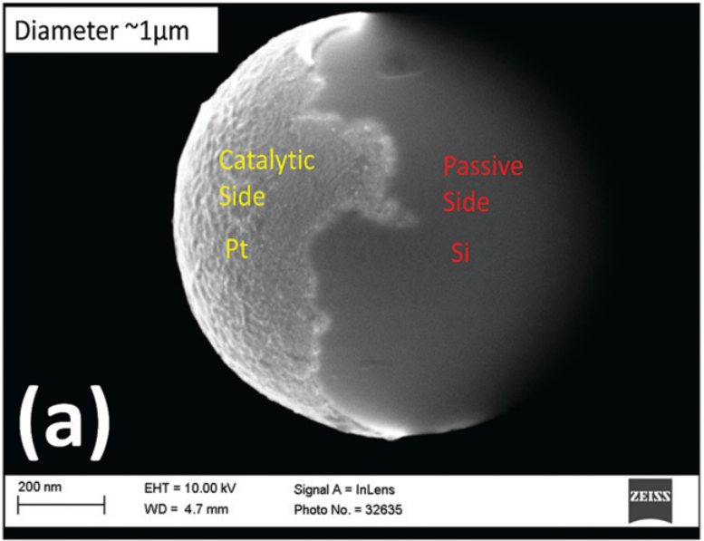

::: {.Janus-citation}
[Saad and Natale, Soft Matter, 2019](https://pubs.rsc.org/en/content/articlelanding/2019/sm/c9sm01801h/unauth)
:::

::: {.Janus-notes}
A catalytic Janus particle with asymmetric surface coating
:::

:::

::: {.Janus-column-layout}

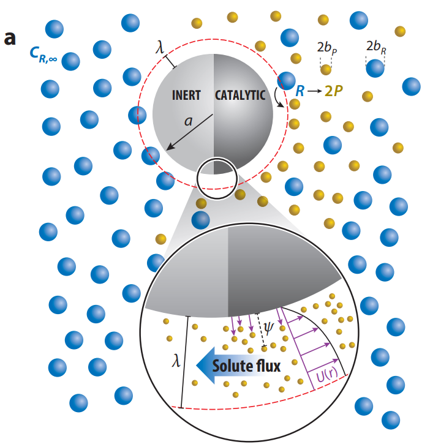

::: {.Janus-citation}
[Moran and Posner, Annu. Rev. Fluid Mech., 2017](https://www.annualreviews.org/content/journals/10.1146/annurev-fluid-122414-034456)
:::

::: {.Janus-notes}
Asymmetric surface reactions create a self-generated solute gradient that drives diffusiophoretic motion
:::

:::

:::

---

## Active Janus Particles in Viscoelastic Fluids {.motivation-slide .janus-intro-slide}
<!-- ===== P2 : Janus Intro ===== -->

:::: {.columns}

::: {.column width="45%"}
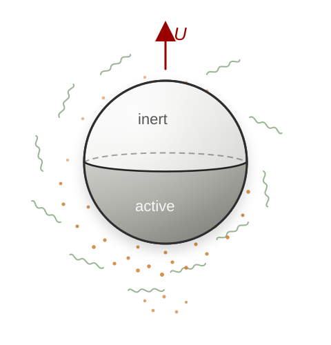{.sphere-polymer-figure}

:::

::: {.column width="55%"}
**Viscoelastic biofluids** — the natural habitat of many swimmers

**Self-diffusiophoretic propulsion** — an asymmetric coating sets up a self-generated solute gradient that drives motion

:::

::::

::: {.takeaway}
How does fluid elasticity change the **propulsion speed** itself?
:::

## Viscoelasticity Reshapes Janus-Particle Dynamics {.motivation-slide .janus-dynamics-slide}

::: {.janus-dynamics-content}

:::: {.columns}

::: {.column width="33%"}

[<strong>Stronger rotational diffusion</strong> with faster motion]{.fig-caption}

[Gomez-Solano et al., *PRL*, 2016]{.ref}
:::

::: {.column width="33%"}
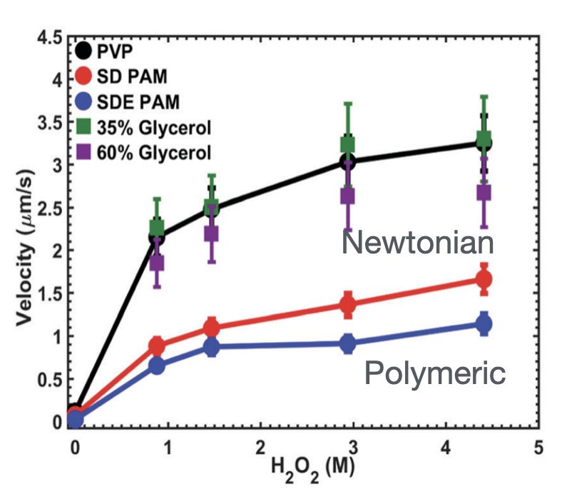

[Propulsion <strong>reduced</strong> in polymer solutions]{.fig-caption}

[Saad & Natale, *Soft Matter*, 2019]{.ref}
:::

::: {.column width="33%"}

[Active motion <strong>suppressed</strong> in polymer solutions]{.fig-caption}

[Raman et al., *ACS Phys. Chem. Au*, 2023]{.ref}
:::

::::

::: {.takeaway}
Experiments reveal rich but noise-dominated dynamics — the *intrinsic* propulsion speed is hard to isolate. To probe it cleanly, we turn to theory.
:::

:::

## Viscoelastic Propulsion of a Spherical Janus Particle {.motivation-slide .spherical-janus-slide}

::: {.spherical-janus-content}

:::: {.columns}

::: {.column width="52%"}

[Datt et al., *J. Fluid Mech.*, 2017]{.ref}
:::

::: {.column width="48%"}

[Weakly viscoelastic limit → second-order fluid model]{.subhead}

::: {.datt-findings}
The first-order viscoelastic correction is **antisymmetric** in surface coverage.

For a half-coated sphere, the leading-order speed correction **vanishes**.
:::

:::

::::

::: {.takeaway}
But what if the Janus particle is **not spherical**?
:::

:::

## From Spheres to Spheroids {.motivation-slide .from-spheres-slide}

:::: {.columns}

::: {.column width="42%"}
{height="300px" fig-align="center"}

[Sphere — correction **vanishes** at half-coating]{.fig-caption}
:::

::: {.column width="16%"}
[?]{.bigq}
:::

::: {.column width="42%"}
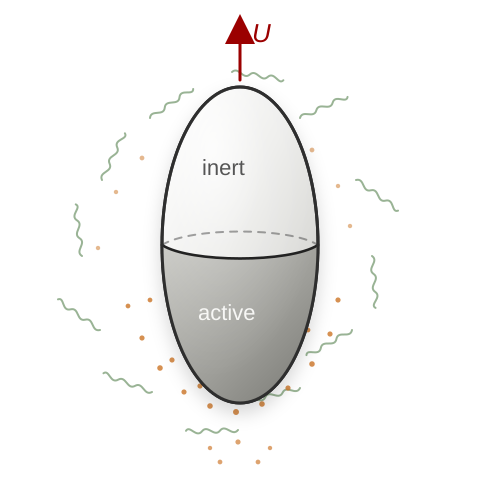{height="300px" fig-align="center"}

[Spheroid — geometric anisotropy]{.fig-caption}
:::

::::

::: {.takeaway}
We vary two control parameters: **eccentricity** $e$ (shape) and **coverage** $\zeta_0$ (activity).
:::

## Model: a spheroidal self-diffusiophoretic particle {.model-slide}

::: {.model-layout}

::: {.model-figure-wrap}
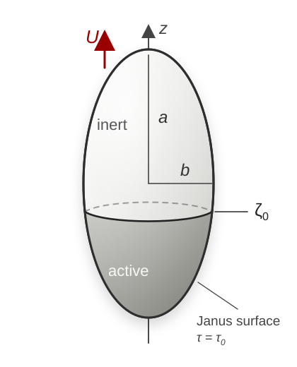{.model-figure}
:::

::: {.model-notes}
- Solve the concentration and flow fields in [prolate spheroidal coordinates]{.key-term} $(\tau,\zeta)$
- Shape parameter: [[eccentricity]{.key-term} $e=\sqrt{a^2-b^2}/a$]{.no-break}
- Activity parameter: [[catalytic coverage]{.key-term} $\zeta_0$]{.no-break}

:::

:::

## Concentration gradients drive surface slip {.model-slide .slip-slide}

::: {.slip-layout}

::: {.slip-figure-wrap}
{.slip-figure}
:::

::: {.slip-content}

::: {.mechanism-block}
**Surface flux $\to$ Concentration field**

$$
\frac{\partial C}{\partial t}
+ \boldsymbol{u}\cdot\nabla C
= D\nabla^2 C,
\quad
\left. D\boldsymbol{n}\cdot\nabla C \right|_{\tau=\tau_0,\zeta<\zeta_0} = -A
$$

::: {.symbol-note}
$C$: solute concentration; $\boldsymbol{u}$: fluid velocity; $D$: solute diffusivity; $A$: surface activity / fixed solute flux on the active cap; $\boldsymbol{n}$: unit normal.
:::
:::

::: {.mechanism-block}
**Tangential gradient $\to$ Phoretic slip**

$$
\boldsymbol{u}_s
=
M(\boldsymbol{I}-\boldsymbol{n}\boldsymbol{n})\cdot \nabla C
$$

::: {.symbol-note}
$M$: phoretic mobility; $(\boldsymbol{I}-\boldsymbol{n}\boldsymbol{n})$: tangential projection operator.
:::
:::

::: {.mechanism-block}
**Slip velocity $\to$ Force-free propulsion**

::: {.propulsion-row}

::: {.propulsion-equation}
::: {.propulsion-equation-grid}

::: {.propulsion-formula}
$$
\boldsymbol{u}(\tau=\tau_0)
= \boldsymbol{u}_s(\zeta)+\boldsymbol{U},
$$
:::

::: {.propulsion-formula}
$$
\int_S \boldsymbol{n}\cdot\boldsymbol{\sigma}\,\mathrm{d}S
= \boldsymbol{0}
$$
:::

:::
:::

::: {.bio-analogy}
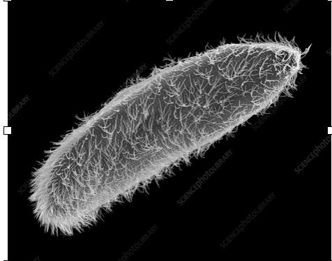{.paramecium-figure}

biological propulsion analogy
:::

:::

:::

:::

:::

::: {.notes}
This is analogous to a squirmer: once there is a tangential slip on the surface, it drives the surrounding fluid, and the force-free condition determines the swimming velocity. The difference is that squirmer models often prescribe slip modes, whereas here the slip comes from the concentration field generated by surface chemistry.
:::

---

## Fluid rheology: second-order fluid model {.model-slide .rheology-slide}

::: {.rheology-content}

::: {.mechanism-block}
**Flow equations**

$$
\nabla\cdot\boldsymbol{\sigma}=\boldsymbol{0},
\qquad
\nabla\cdot\boldsymbol{u}=0,
\qquad
\boldsymbol{\sigma}=-p\boldsymbol{I}+\boldsymbol{T}
$$

::: {.symbol-note}
$\boldsymbol{\sigma}$: total stress; $p$: pressure; $\boldsymbol{T}$: deviatoric stress.
:::
:::

::: {.mechanism-block}
**Second-order fluid model**

::: {.rheology-equation-row}

::: {.rheology-main-equation}
$$
\boldsymbol{T}
=
\mu\dot{\boldsymbol{\gamma}}
-\frac{\Psi_1}{2}\boldsymbol{G}
+\Psi_2\dot{\boldsymbol{\gamma}}\cdot\dot{\boldsymbol{\gamma}},
$$
:::

::: {.rheology-main-equation}
$$
\begin{aligned}
\boldsymbol{G}
=&
\boldsymbol{u}\cdot\nabla\dot{\boldsymbol{\gamma}}
-(\nabla\boldsymbol{u})^{\mathrm{T}}\cdot\dot{\boldsymbol{\gamma}}
-\dot{\boldsymbol{\gamma}}\cdot\nabla\boldsymbol{u}
\end{aligned}
$$
:::

:::

::: {.symbol-note}
$\mu$: viscosity; $\dot{\boldsymbol{\gamma}}$: shear-rate tensor; $\Psi_1,\Psi_2$: first and second normal-stress coefficients; $\boldsymbol{G}$: steady upper-convected derivative.
:::
:::

::: {.mechanism-block}
**Non-dimensionalization**

::: {.scale-row}
[length scale:]{.scale-label} semi-major axis of the particle  $a$,

[velocity scale:]{.scale-label} $MA/D$
:::

::: {.dimensionless-row}
[Peclet number (advection/diffusion):]{.scale-label} [$\mathrm{Pe}=\dfrac{MAa}{D^2}$]{style="color:#155a9c;"}

[Deborah number (fluid elasticity):]{.scale-label} [$\mathrm{De}=\dfrac{MA\Psi_1}{2\mu D a}$]{style="color:#8c0000;"}
:::

:::

:::

## Diffusion-dominated solute transport {.model-slide .diffusion-slide}

::: {.diffusion-content}

::: {.mechanism-block}
**Diffusion-dominated solute field**

$$
\nabla^2 c=0,
\qquad
\left.\boldsymbol{n}\cdot\nabla c\right|_{\tau=\tau_0}
=
\begin{cases}
-1, & \zeta\le \zeta_0 \quad \text{active},\\
0, & \zeta>\zeta_0 \quad \text{inert},
\end{cases}
\qquad
c|_{\tau\to\infty}=0
$$

::: {.symbol-note}
$c$: dimensionless relative solute concentration; $\tau=\tau_0$: particle surface.
:::
:::

::: {.mechanism-block}
**Series solution and induced slip**

::: {.solute-equation-row}

::: {.solute-main-equation}
$$
c(\tau,\zeta)
=
\sum_{n=0}^{\infty}
\rho_n Q_n(\tau)P_n(\zeta)
$$
:::

::: {.solute-main-equation}
$$
\implies u_s(\zeta)
=
\tau_0\sum_{n=1}^{\infty}
B_n\frac{P_n^1(\zeta)}{\sqrt{\tau_0^2-\zeta^2}}
$$
:::

:::

::: {.symbol-note}
$P_n,Q_n$: Legendre functions; $\rho_n$: coefficients set by the flux boundary condition; $B_n=-\rho_n Q_n(\tau_0)$.
:::
:::

::: {.caveat-row}

::: {.caveat-block}

::: {.caveat-text}
**Note: finite-$\mathrm{Pe}$ coupling**

At finite $\mathrm{Pe}$, advection couples the solute field back to the flow. Then the rheology can also affect the concentration and the slip generated inside the interaction layer.
:::

:::

::: {.caveat-figure-wrap}
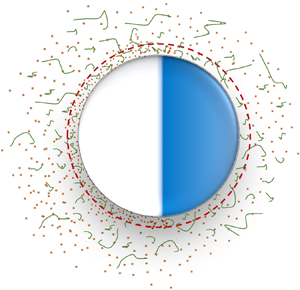{.caveat-figure}

::: {.caveat-citation}
[Choudhary et al., J. Fluid Mech., 2020](https://www.cambridge.org/core/journals/journal-of-fluid-mechanics/article/nonnewtonian-effects-on-the-slip-and-mobility-of-a-selfpropelling-active-particle/BBF8AD5E37B5D3679BFC0A705750718C)
:::
:::

:::

:::

## Newtonian baseline {.model-slide .slip-slide}

::: {.model-clean-layout .newtonian-baseline-layout}

::: {.model-lead}
Weakly viscoelastic: expand in $\mathrm{De}\ll 1$
:::

::: {.model-equation}
$$
\{\boldsymbol{u}, p, \boldsymbol{U}\} = \{\boldsymbol{u}_0, p_0, \boldsymbol{U}_0\} + \mathrm{De}\{\boldsymbol{u}_1, p_1, \boldsymbol{U}_1\} + \mathcal{O}(\mathrm{De}^2)
$$
:::

:::: {.baseline-row}

::: {.baseline-text-panel}
The zeroth order is the Newtonian problem, valid for any eccentricity, with a known speed:

::: {.model-equation}
$$
U_0 =
-\frac{\tau_0}{2}
\int_{-1}^{1}
u_s
\frac{\sqrt{1-\zeta^2}}{\sqrt{\tau_0^2-\zeta^2}}
\,\mathrm{d}\zeta
$$
:::

::: {.ref}
Poehnl et al., J. Phys.: Condens. Matter, 2020; Popescu et al., Eur. Phys. J. E, 2010
:::

:::

::: {.baseline-figure-panel}
{.baseline-figure}

::: {.takeaway}
Linearity makes the Newtonian speed symmetric about half-coating: $U_0(\zeta_0)=U_0(-\zeta_0)$.
:::
:::

::::

:::

---

## First-order viscoelastic correction {.model-slide .slip-slide}

::: {.model-clean-layout .reciprocal-correction-layout}

::: {.model-block}
Viscoelasticity enters as a forcing term, set by the Newtonian flow:

::: {.model-equation}
$$
\boldsymbol{\sigma}_1 = -p_1\boldsymbol{I} + \dot{\boldsymbol{\gamma}}_1 + \boldsymbol{A},
\qquad
\boldsymbol{A} = -(\boldsymbol{G}_0 + b\,\dot{\boldsymbol{\gamma}}_0\cdot\dot{\boldsymbol{\gamma}}_0)
$$
:::
:::

::: {.model-block}
An auxiliary towing problem + the reciprocal theorem give $U_1$ directly, without solving the first-order flow:

::: {.model-equation .wide-equation .equation-highlight}
$$
U_1 =
-\frac{(\tau_0^2+1)\operatorname{coth}^{-1}\tau_0-\tau_0}{4\tau_0^2}
\int_{\tau_0}^{\infty}\int_{-1}^{1}
(\boldsymbol{A}:\nabla\hat{\boldsymbol{u}})(\tau^2-\zeta^2)\,\mathrm{d}\zeta\,\mathrm{d}\tau
$$
:::

::: {.symbol-note}
$\nabla\hat{\boldsymbol{u}}$: velocity gradient of the auxiliary (towing) flow.
:::
:::

:::

## The spherical cancellation is a symmetry {.results-slide .spherical-cancellation-slide}

{height="220px" fig-align="center"}

::: {.spherical-cancellation-flow}
In a second-order fluid, a mirror reflection must be paired with **De → −De**:

$$U(\zeta_0, \mathrm{De}) = U(-\zeta_0, -\mathrm{De})$$

::: {.takeaway}
Half-coating is its own mirror ⟹ **U even in De**: the O(De) correction **vanishes**, leading correction is **O(De²)**.
:::

:::

## Eccentricity revives the correction {.results-slide .eccentricity-revival-slide}

::: {.eccentricity-revival-content}

:::: {.columns}

::: {.column width="55%"}
{height="340px" fig-align="center"}
:::

::: {.column width="45%"}

::: {.subhead}
Half-coated particle: $\zeta_0=0$
:::

- Sphere: $U_1=0$, protected by symmetry
- Spheroid: eccentricity breaks the cancellation
- Slender particles: **pronounced speed enhancement**

:::

::::

:::

## Breaking the coverage symmetry {.results-slide .coverage-symmetry-slide}

::: {.coverage-symmetry-content}

:::: {.columns}

::: {.column width="50%"}
[Antisymmetry lost as $e$ grows]{.fig-caption}

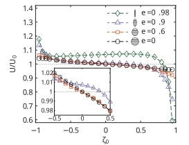{height="300px" fig-align="center"}

:::

::: {.column width="50%"}
[Phase diagram: enhancement vs reduction]{.fig-caption}

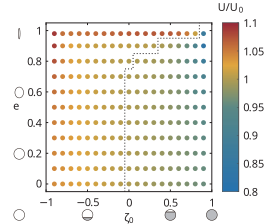{height="300px" fig-align="center"}

:::

::::

::: {.takeaway}
Eccentricity breaks the coverage <strong>antisymmetry</strong>, and the <strong>enhancement regime broadens</strong> with elongation.
:::

:::

## Why the cancellation breaks {.results-slide .why-cancellation-slide}

::: {.why-cancellation-content}

- The first-order speed is set by a local kernel: $U_1 \propto \int_V$ 𝒦 $\mathrm{d}V$, where 𝒦 $= \boldsymbol{A}:\nabla\hat{\boldsymbol{u}}$ (blue enhances, red reduces)

:::: {.columns}

::: {.column width="50%"}
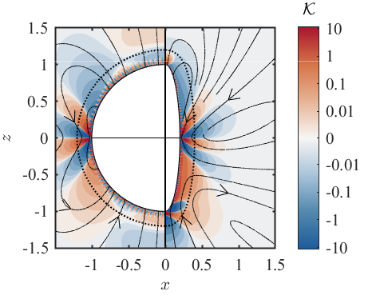{height="300px" fig-align="center"}

::: {.kernel-sentence}
Sphere — 𝒦 <strong>antisymmetric</strong>, cancels exactly ⟹ $U_1=0$
:::
:::

::: {.column width="50%"}
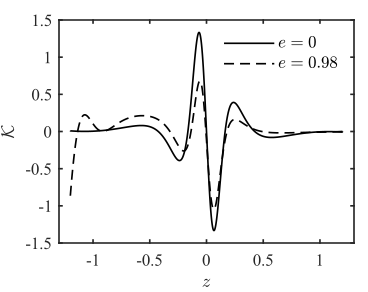{height="300px" fig-align="center"}

::: {.kernel-sentence}
Spheroid — curvature localizes 𝒦, <strong>antisymmetry broken</strong> ⟹ $U_1\neq0$
:::
:::

::::

:::

## Summary {.summary-slide}

:::: {.summary-main}

::: {.summary-points}

- <strong>Spheres</strong> — the half-coated correction vanishes, protected by reflection symmetry
- <strong>Spheroids</strong> — eccentricity breaks it; slender particles are strongly enhanced
- <strong>General principle</strong> — symmetry breaks only when both shape anisotropy and fluid nonlinearity are present

:::

::: {.summary-visual}
{height="280px" fig-align="center"}
:::

::::

::: {.summary-credit}
{height="130px"}

::: {.summary-credit-text}
**Qiang Zhao**

First author · PhD student, Peking University
:::
:::

::: {.summary-logo}
{width="190px"}
:::
